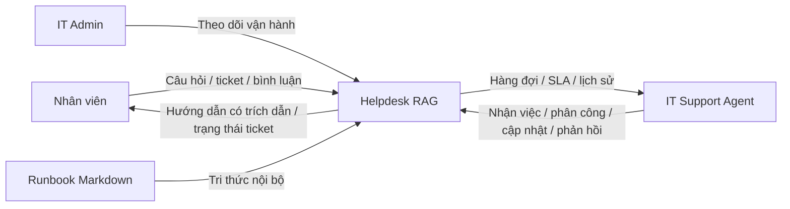
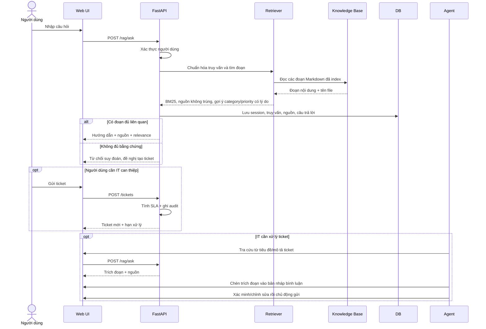
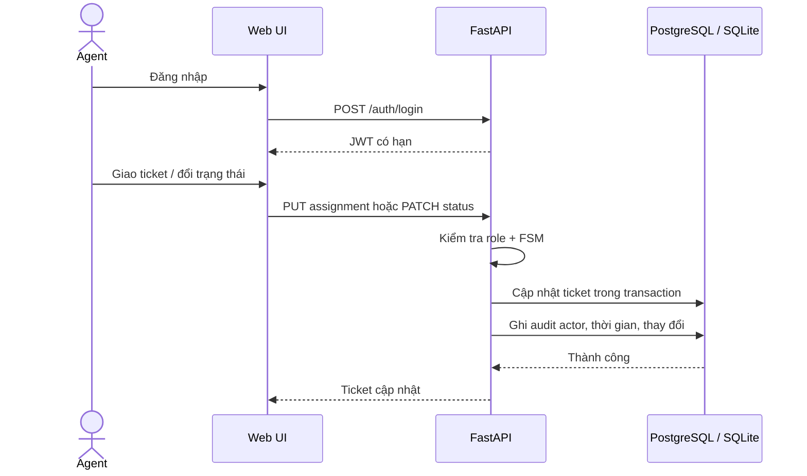
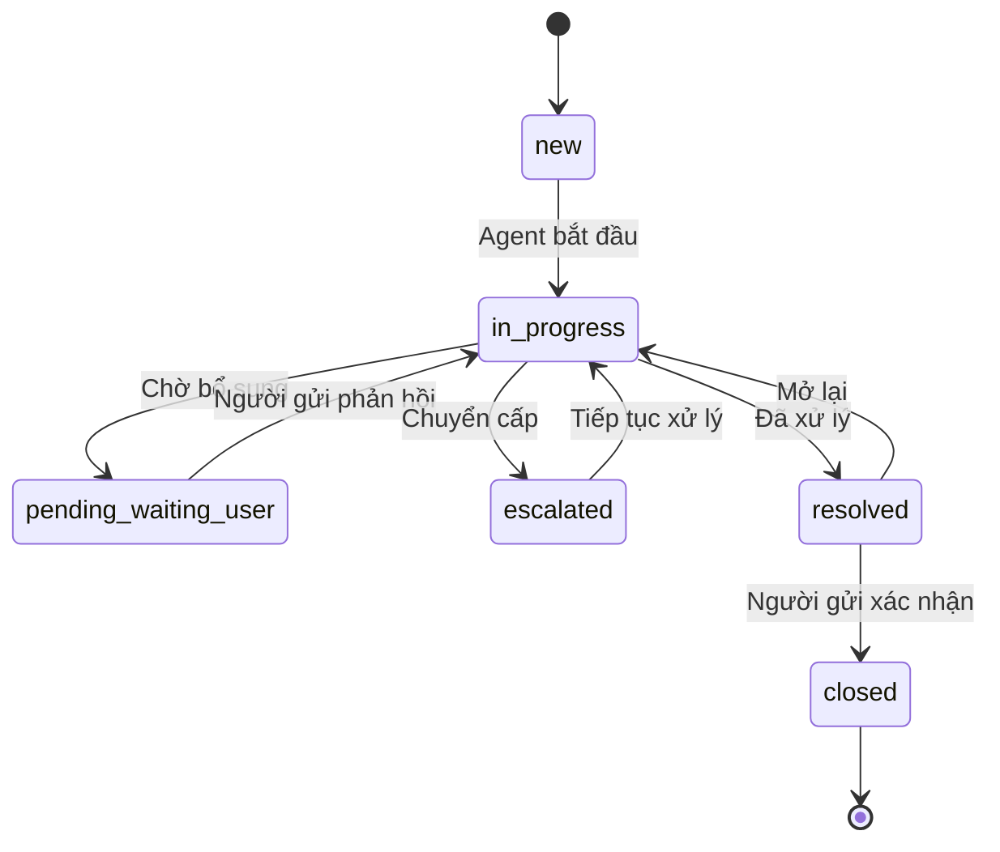
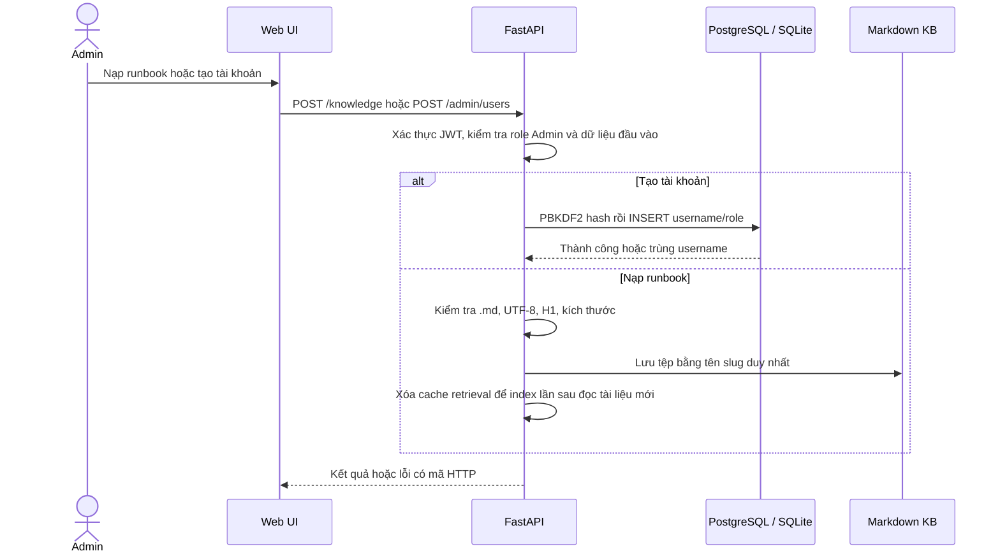
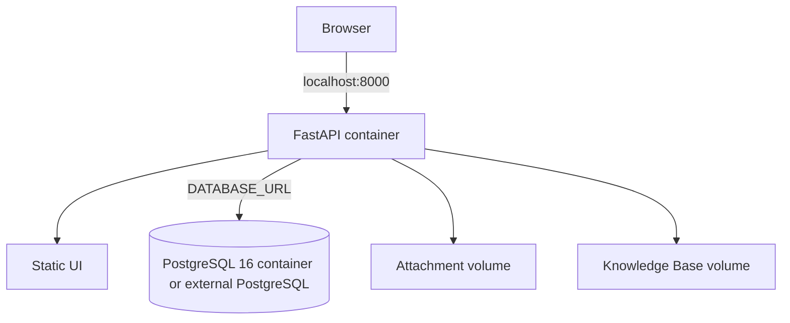
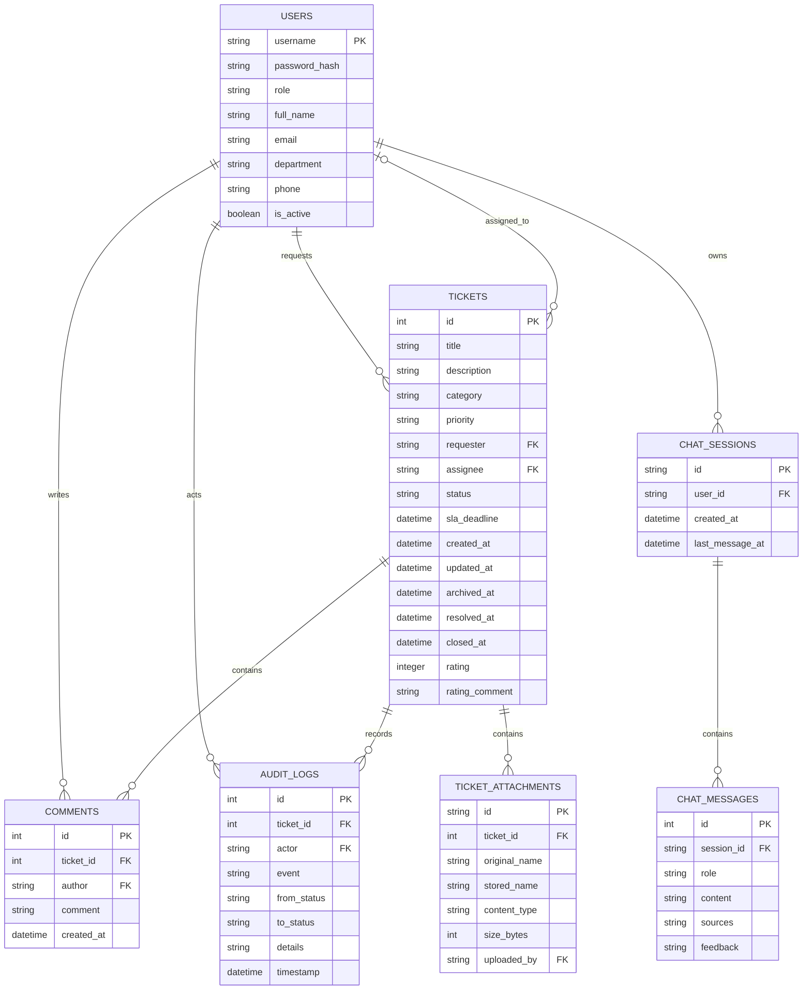

# Thiết kế phần mềm (SDD)

**Phiên bản:** 1.0 — khớp prototype hiện tại\
**Stack:** FastAPI, PostgreSQL cho Docker Compose hoặc SQLite cho local development/test, HTML/CSS/JavaScript tĩnh, bộ truy xuất BM25 tối giản.

## 1. Kiến trúc thành phần

```mermaid
flowchart LR
  Browser[Web UI: HTML/CSS/JS] -->|HTTP(S) / JSON API| API[FastAPI]
  API --> Auth[Auth + RBAC]
  API --> Tickets[Ticket / SLA / Audit]
  API --> RAG[RAG retrieval]
  Tickets --> DB[(PostgreSQL / SQLite)]
  Files[Local attachment storage] --> API
  RAG --> Markdown[Markdown Knowledge Base]
  RAG -->|trích đoạn + file nguồn| API
```

Trong demo, ứng dụng web và API chạy cùng FastAPI. `DATABASE_URL` chọn PostgreSQL; nếu không đặt, ứng dụng dùng SQLite. Hai backend lưu người dùng, ticket, bình luận, audit log, attachment metadata và lịch sử RAG. Docker Compose khởi chạy PostgreSQL 16 có named volume; SQLite vẫn là mặc định local và test. Mô-đun truy xuất đọc Markdown, chia đoạn, chuẩn hóa truy vấn tiếng Việt và xếp hạng bằng BM25 có tăng trọng số token xuất hiện trong tiêu đề; mỗi nguồn chỉ xuất hiện một lần trong top-k. Không có dịch vụ LLM bên ngoài. UI có lựa chọn Việt/Anh lưu trong browser; nội dung do người dùng/tác giả nhập không tự dịch.

## 2. Sơ đồ ngữ cảnh



## 3. Sequence — gợi ý RAG và tạo ticket



## 4. Sequence — Agent tiếp nhận và xử lý



## 5. FSM trạng thái



## 6. Quy trình quản trị tri thức/tài khoản



## 7. Sơ đồ triển khai demo



Docker Compose chạy service PostgreSQL 16 và ứng dụng, bind web/API vào loopback `127.0.0.1:8000`; database, attachment và Knowledge Base có named volume riêng. App container chạy bằng UID không đặc quyền; healthcheck gọi `/health`. `DATABASE_URL` có thể trỏ PostgreSQL bên ngoài, nhưng Compose hiện vẫn khởi chạy service PostgreSQL cục bộ. Không có công cụ migration dữ liệu SQLite cũ sang PostgreSQL hoặc migration tổng quát cho PostgreSQL production sẵn có. Chưa có Nginx, worker, vector database, TLS, backup/restore tự động, HA hoặc cấu hình production.

## 8. Mô hình dữ liệu (ERD)



### Từ điển dữ liệu

| Bảng | Trường | Ý nghĩa / ràng buộc |
|---|---|---|
| `users` | `username` | Khóa chính; 3–50 ký tự, chữ/số/`._-`; được chuẩn hóa chữ thường khi tạo qua API |
| `users` | `password_hash` | PBKDF2-HMAC-SHA256, salt ngẫu nhiên; không trả qua API |
| `users` | `role` | `user`, `agent` hoặc `admin` |
| `users` | `full_name`, `email`, `department`, `phone`, `is_active` | Hồ sơ cơ bản; `is_active=0` chặn đăng nhập và phân công |
| `tickets` | `id` | Khóa chính tăng tự động |
| `tickets` | `requester`, `assignee` | Khóa ngoại tới `users`; assignee để trống hoặc Agent/Admin |
| `tickets` | `title`, `description`, `category` | Tiêu đề 5–160, mô tả 10–5000, loại 2–50 ký tự qua API |
| `tickets` | `priority`, `status` | Enum được ràng buộc ở schema SQLite và API; PostgreSQL cần được tạo từ schema hiện hành |
| `tickets` | `resolved_at`, `closed_at`, `rating`, `rating_comment` | Mốc hoàn tất và đánh giá 1–5 của chủ ticket |
| `tickets` | `sla_deadline` | Thời gian UTC; mục tiêu tính bằng giờ lịch theo ưu tiên |
| `tickets` | `created_at`, `updated_at`, `archived_at` | Mốc UTC ISO-8601; `archived_at` null khi còn hoạt động |
| `comments` | `ticket_id`, `author` | Khóa ngoại; bình luận gắn ticket và user |
| `audit_logs` | `ticket_id`, `actor`, `event` | Lịch sử thay đổi; lưu tác nhân/thời gian/trạng thái/chi tiết; ticket archive không xóa log |
| `ticket_attachments` | `stored_name`, `content_type`, `size_bytes` | Tệp PNG/JPG/TXT/LOG tối đa 10 MiB; tên lưu trữ sinh ngẫu nhiên, download qua API có xác thực |
| `chat_sessions`, `chat_messages` | `user_id`, `session_id`, `sources`, `feedback` | Lịch sử tra cứu được giới hạn theo chủ phiên; feedback gắn câu trả lời |

SQLite migration idempotent khi khởi động thêm hồ sơ user, metadata kết quả/đánh giá và các bảng phụ; bảng `tickets` được thay cấu trúc để thêm trạng thái chờ/chuyển cấp mà vẫn giữ dữ liệu SQLite cũ. PostgreSQL được khởi tạo từ schema hiện hành và thêm các cột thiếu, nhưng chưa thay thế constraints cũ hoặc chuyển đổi dữ liệu/backend.

## 9. API chính

| Method | Endpoint | Quyền / hành vi |
|---|---|---|
| GET | `/config` | Công khai; chỉ trả cờ `demo_mode` để UI hiện/ẩn thông tin tài khoản mẫu |
| POST | `/auth/login` | Công khai |
| GET | `/auth/me` | Đã đăng nhập |
| GET | `/staff` | Agent/Admin; danh sách tên/vai trò để chọn người được giao |
| GET | `/admin/users` | Admin; username/vai trò, không lộ hash |
| POST | `/admin/users` | Admin; username duy nhất, mật khẩu ≥12 ký tự |
| PATCH | `/admin/users/{username}` | Admin; hồ sơ, vai trò và active; không thể tự khóa hoặc khóa Admin cuối |
| GET/POST | `/tickets` | Đã đăng nhập; tạo ticket cho chính mình |
| GET | `/tickets/{id}` | Chủ ticket hoặc IT; ticket đã lưu trữ trả 404 |
| PUT | `/tickets/{id}` | Chủ chỉ khi `new`; Agent/Admin trước `closed` |
| PATCH | `/tickets/{id}` | Agent/Admin; kiểm tra FSM |
| DELETE | `/tickets/{id}` | Admin; lưu trữ mềm |
| PUT | `/tickets/{id}/assignment` | Agent/Admin |
| POST | `/tickets/{id}/comments` | Chủ ticket hoặc IT |
| POST/GET | `/tickets/{id}/attachments` | Chủ ticket hoặc IT; PNG/JPG/TXT/LOG ≤10 MiB |
| POST | `/tickets/{id}/rate` | Chủ ticket; ticket đã giải quyết/đóng |
| GET | `/tickets/{id}/audit` | Chủ ticket hoặc IT |
| GET | `/analytics` | Agent/Admin |
| GET | `/analytics/agents/me` | Agent/Admin; ticket gán cho tài khoản hiện tại |
| GET | `/analytics/export` | Admin; xuất CSV |
| GET | `/knowledge` | Đã đăng nhập |
| POST | `/knowledge` | Admin; Markdown UTF-8 ≤256 KiB, có H1 |
| DELETE/POST | `/knowledge/{source}` | Admin; xóa hoặc làm mới index Markdown |
| POST | `/rag/ask` | Đã đăng nhập; BM25, nguồn và abstention |
| GET | `/rag/sessions` | Đã đăng nhập; phiên của chính người dùng |
| POST | `/rag/feedback` | Đã đăng nhập; feedback câu trả lời trong phiên của mình |
| GET | `/health` | Công khai |

## 10. An toàn, lỗi và giới hạn

- Mật khẩu mẫu được lưu bằng PBKDF2; JWT dùng secret cấu hình qua biến môi trường.
- Demo tự sinh secret ngẫu nhiên khi không cấu hình; chế độ non-demo yêu cầu secret và bootstrap admin. Nếu DB vẫn chứa credential mẫu chưa đổi, startup non-demo chủ động từ chối để không vô tình dùng lại tài khoản demo. Chỉ dùng tài khoản mẫu ở local.
- Trước khi triển khai thật vẫn cần bật HTTPS, quản lý secret an toàn, rate limit, backup/restore, rà soát phụ thuộc và kiểm thử bảo mật theo môi trường.
- Các thao tác ghi cơ sở dữ liệu dùng parameter binding và foreign key.
- Tệp đính kèm có allow-list phần mở rộng, tên lưu trữ ngẫu nhiên, giới hạn dung lượng, quyền download và `X-Content-Type-Options: nosniff`; chưa có antivirus scan, quota tổng hoặc retention automation.
- SQL động cho bộ lọc/cập nhật chỉ ghép tên trường nội bộ từ danh sách cho phép; mọi giá trị truy vấn vẫn bind parameter.
- BM25 và synonym map chỉ là baseline; điểm relevance không phải xác suất độ đúng.
- Response `/rag/ask` kèm `triage`: danh mục theo source đứng đầu và ưu tiên heuristic theo các cụm từ tác động rõ ràng. Web hiển thị lý do và chỉ điền vào form khi người dùng chọn chuyển tiếp; mọi giá trị còn sửa được trước submit. Đây không phải dự đoán ML/chẩn đoán hay SLA được đơn vị nghiệp vụ phê duyệt.
- SQLite phù hợp development/test đơn máy; Docker Compose dùng PostgreSQL persistent. Chưa có kết quả thử tải/HA hoặc bằng chứng vận hành production.
